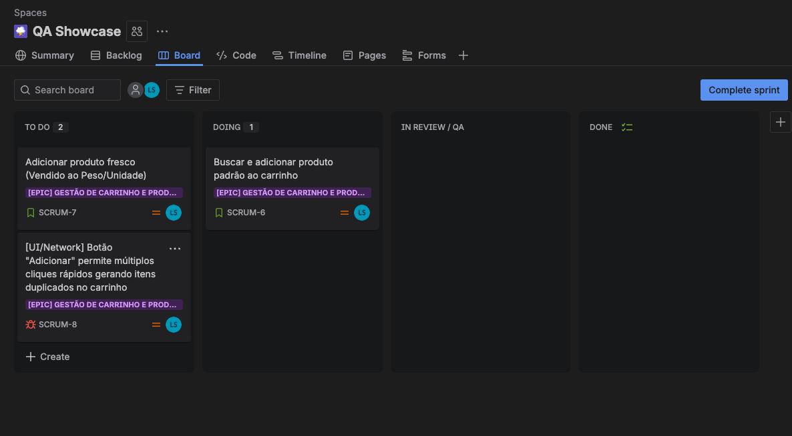
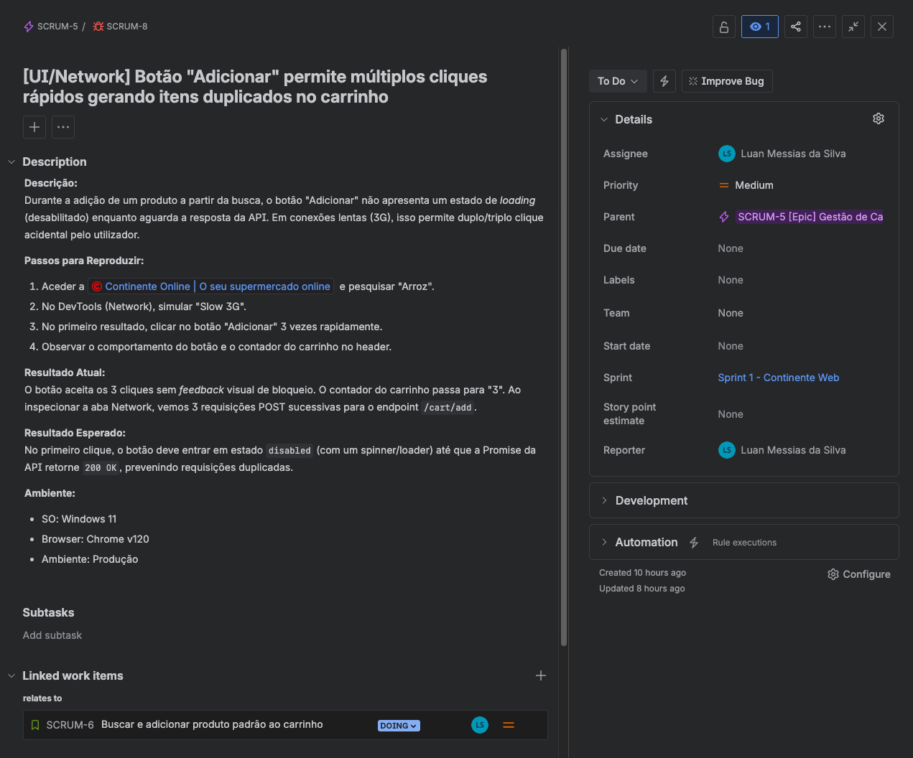
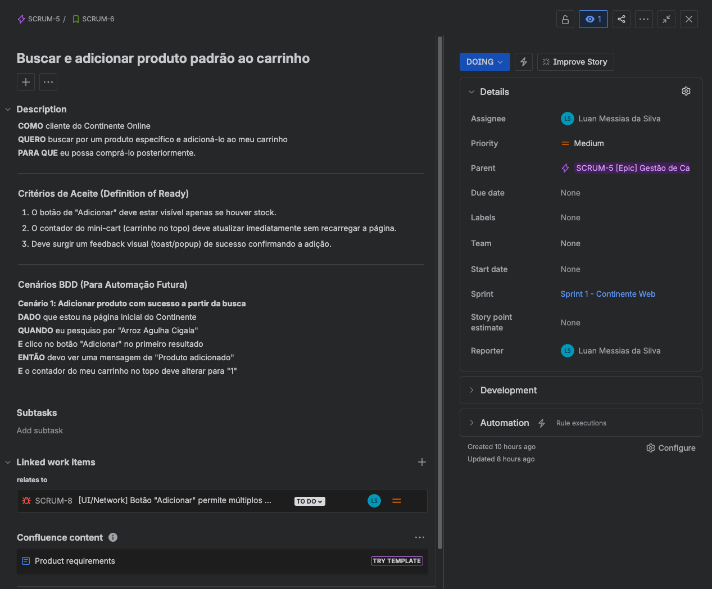
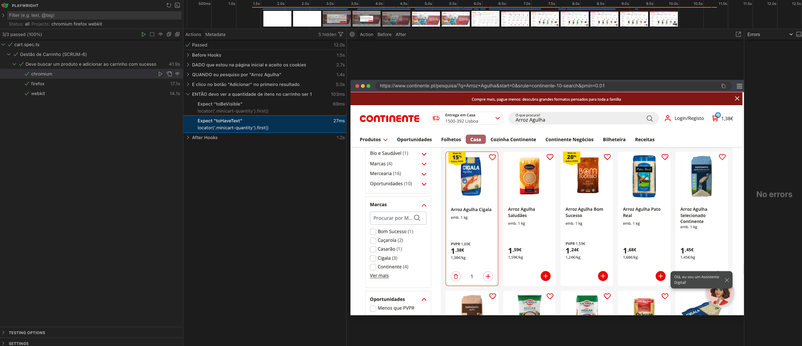

# 🛒 Automação E2E & Agile QA - Continente E-Commerce

Este projeto demonstra a abordagem completa de um ciclo de Quality Assurance num ambiente Ágil, utilizando o e-commerce real do [Continente](https://www.continente.pt/) como caso de estudo. O foco está na rastreabilidade entre os requisitos de negócio (Jira) e a execução técnica (Playwright).

### Por que o Continente E-Commerce?
O Continente foi escolhido por ser um dos maiores retalhistas em Portugal, possuindo um e-commerce complexo com regras de negócio desafiadoras (ex: produtos vendidos ao peso, gestão de stock dinâmica, múltiplas variantes). Isso torna-o um cenário ideal para demonstrar testes robustos focados no utilizador e na estabilidade do carrinho de compras.

## 🛠️ Stack Tecnológico
- **Ferramenta de Automação:** Playwright (TypeScript)
- **Design Pattern:** Component Object Model (POM atómico)
- **Gestão Ágil:** Jira Software (Scrum)
- **Gestão de Pacotes:** pnpm

## 📂 Estrutura e Atalhos
- **[Plano de Testes e Cenários (BDD)](./docs/test-cases/cenarios_carrinho.md)**: Especificações em formato Gherkin abrangendo caminhos felizes e de exceção.
- **[Relatórios de Bugs (Bug Reports)](./docs/bugs/bug_01_multiplos_cliques.md)**: Relatórios detalhados de anomalias encontradas, incluindo evidências e passos para reproduzir.
- **[/e2e](./e2e/)**: Script completo de automação cobrindo o fluxo de busca e adição ao carrinho com estabilidade cross-browser.

## 🚀 Como executar a automação
#### 1. Navegue até à pasta `e2e/`:
   ```bash
   cd e2e
   ```

#### 2. Instale as dependências:
   ```bash
   pnpm install
   ```
#### 3. Rode os testes em todos os browsers (Chromium, Firefox, WebKit):
   ```bash
    pnpm exec playwright test
   ```
#### 4. Gere e visualize o relatório HTML detalhado:
   ```bash
   pnpm exec playwright show-report
   ```

## 📸 Galeria do Projeto: Agile & Automação

Abaixo estão as evidências da rastreabilidade entre o planeamento ágil (Jira) e a execução técnica (Playwright).

#### 1. Visão Geral da Sprint (Jira Board)

> **Gestão Ágil:** Quadro Scrum ativo demonstrando a organização das tarefas, uso de Épicos para agrupar o contexto de negócio e o rastreamento em tempo real do progresso da Sprint.

---

#### 2. Gestão de Defeitos (Bug Report)

> **Rastreabilidade e Clareza:** Reporte de um defeito real (UI/Network) encontrado durante a exploração. O ticket inclui os passos para reproduzir, resultados esperados vs. atuais, ambiente de teste e a ligação direta (bloqueio) à User Story original.

---

#### 3. Especificação Ágil (BDD)

> **Alinhamento com o Negócio:** User Story detalhada utilizando o padrão "Como / Quero / Para que" e os critérios de aceite mapeados em Gherkin (Dado / Quando / Então), servindo de base direta para o script de automação.

---

#### 4. Execução E2E (Playwright HTML Report)

> **Automação e Reporte:** Relatório de execução gerado pelo Playwright provando a estabilidade da automação em 3 browsers distintos (Chromium, Firefox, WebKit). Os blocos expansíveis espelham perfeitamente o BDD definido no Jira, criando uma documentação viva.