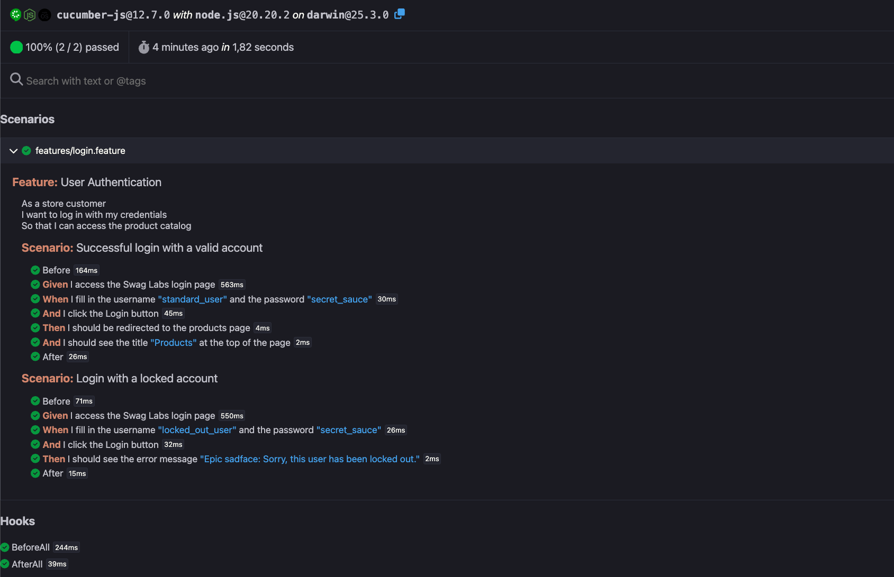

# Estratégia de Testes: Fluxo de Autenticação (E2E)

**Contexto:** Este repositório demonstra a implementação de testes de ponta a ponta (E2E) utilizando a metodologia BDD (Behavior-Driven Development) para garantir que a documentação técnica seja legível por todas as áreas do negócio.

**Alvo:** [Swag Labs (SauceDemo)](https://www.saucedemo.com/)
**Tech Stack:** Playwright, Cucumber, Node.js, TypeScript
**Arquitetura:** Page Object Model (POM) integrado com Step Definitions

---

##  Cenários Levantados (Test Design)

1. **Caminho Feliz:** Login com credenciais válidas direciona para o inventário.
2. **Caminho Triste:** Login com utilizador bloqueado (`locked_out_user`) deve exibir mensagem de erro específica.
3. **Caminho de Limite:** Tentativa de login sem preencher a password deve barrar o envio e alertar o utilizador. *(A implementar)*

---

##  Relatório de Execução Automática (Evidence)

Abaixo está a evidência da execução automatizada dos cenários descritos, gerada nativamente pelo *Cucumber HTML Repor

ter*. O relatório valida a passagem de todos os *steps* mapeados no Gherkin:

